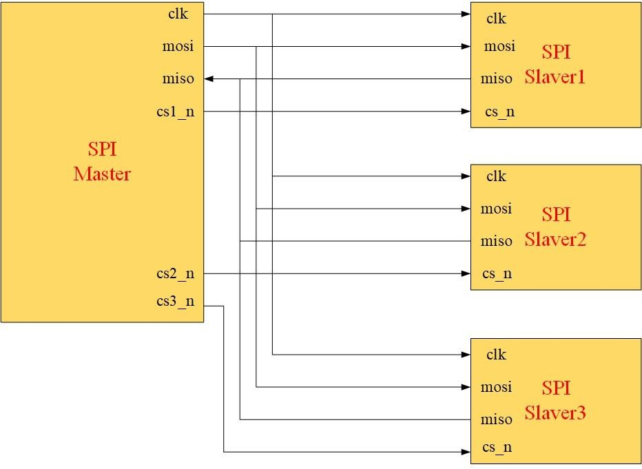
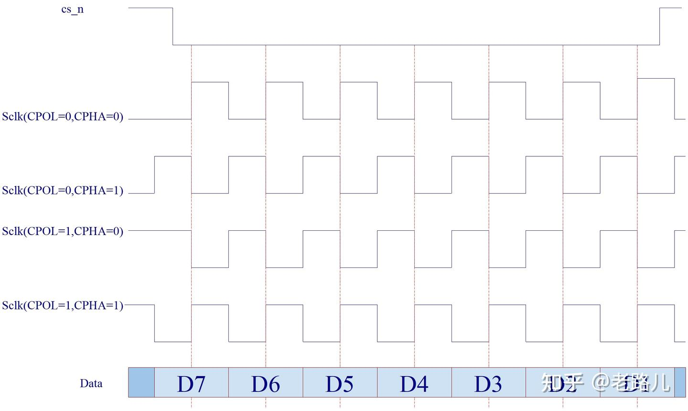

# SPI 协议详解

## 简介
SPI（Serial Peripheral Interface）是一种高速的，全双工，同步的通信总线，并且在芯片的管脚上只占用四根线，节约了芯片的管脚，同时为PCB的布局上节省空间，提供方便，正是出于这种简单易用的特性，现在越来越多的芯片集成了这种通信协议。

## 接口定义
SPI总线通常有4根线：
1.  **SCLK (Serial Clock)**: 时钟信号，由主设备产生。
2.  **MOSI (Master Output Slave Input)**: 主设备输出/从设备输入。
3.  **MISO (Master Input Slave Output)**: 主设备输入/从设备输出。
4.  **CS/SS (Chip Select / Slave Select)**: 片选信号，由主设备控制，低电平有效。

## 传输特点
1.  **SPI通信为主从模式**:支持一主多从的通信方式，主机通过片选CS信号选中从机。其中需要注意的是：时钟信号CLK只能由主机产生。
2.  **SPI为同步通信协议**:SPI在传输数据的同时传输时钟信号。主机根据将要交换的数据产生时钟脉冲信号，时钟信号通过时钟极性（Clock Polarity）和时钟相位（Clock Phase）规定两个SPI设备在何时进行数据交换和数据采样，实现两个SPI设备的同步传输。
3.  **SPI为全双工通信协议**:SPI同时拥有TX（MOSI）数据通道和RX（MISO）数据通道，为全双工通信。

    
     
    SPI一主多从通信

## 通信过程
1.  **主设备发起**: 主设备拉低对应从设备的CS信号，选中该从设备。
2.  **时钟同步**: 主设备产生SCLK时钟信号。
3.  **数据传输**: 在每个时钟周期内，主设备和从设备同时发送和接收一位数据。
    *   主设备通过MOSI发送数据。
    *   从设备通过MISO发送数据。
4.  **结束**: 传输完成后，主设备拉高CS信号，结束通信。

## 时钟极性和相位 (CPOL & CPHA)
SPI有四种工作模式，由时钟极性（CPOL）和时钟相位（CPHA）决定。

*   **CPOL (Clock Polarity)**: 定义时钟空闲时的电平。
    *   CPOL=0: SCLK空闲时为低电平。
    *   CPOL=1: SCLK空闲时为高电平。
*   **CPHA (Clock Phase)**: 定义数据采样的时刻。
    *   CPHA=0: 在第一个跳变沿（上升沿或下降沿）采样。
    *   CPHA=1: 在第二个跳变沿采样。

### 四种模式
| 模式 | CPOL | CPHA | 行为 |
| :--- | :--- | :--- | :--- |
| Mode 0 | 0 | 0 | SCLK空闲时为低电平，上升沿采样数据，下降沿切换数据 |
| Mode 1 | 0 | 1 | 空闲低电平，SCLK空闲时为低电平，下降沿采样数据，上升沿切换数据 |
| Mode 2 | 1 | 0 | SCLK空闲时为高电平，下降沿采样数据，上升沿切换数据 |
| Mode 3 | 1 | 1 | SCLK空闲时为高电平，上升沿采样数据，下降沿切换数据 |

    
     
    SPI四种传输模式

## 设计框图

    
     
    SPI设计框图

## 优缺点
### 优点
*   全双工通信，速度快。
*   硬件连接简单（仅需4根线）。
*   协议灵活，支持任意数据位长度。

### 缺点
*   没有硬件从机应答机制（不像I2C）。
*   没有标准的错误检查机制。
*   通常只支持单主设备。
*   距离较短，主要用于板级通信。
