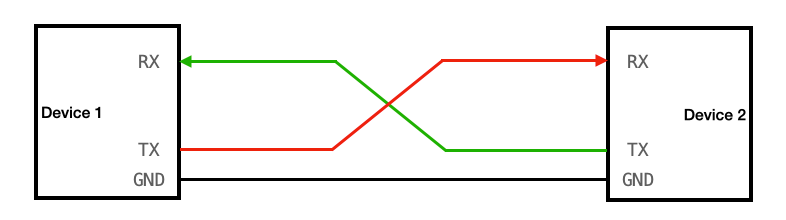

# UART 协议详解

## 简介
UART（Universal Asynchronous Receiver/Transmitter）即通用异步收发传输器，是一种异步收发传输协议。它将要传输的数据在串行通信与并行通信之间进行转换。作为一种通用串行数据总线，UART用于异步通信，该总线双向通信，可以实现全双工传输和接收。

## 接口定义
UART通信通常只需要3根线：
1.  **TX (Transmit)**: 发送数据端，连接对端的RX。
2.  **RX (Receive)**: 接收数据端，连接对端的TX。
3.  **GND (Ground)**: 接地，通信双方必须共地。

## 传输特点
1.  **异步通信**: 不需要时钟信号进行同步，发送方和接收方通过约定的波特率（Baud Rate）来控制数据的发送和接收速率。
2.  **全双工通信**: 拥有独立的TX发送通道和RX接收通道，可以同时进行数据的发送和接收。
3.  **电平标准**: 常见的有TTL电平（0V/3.3V或5V）和RS-232电平（负逻辑，-15V~+15V）。

    
     
    UART连接示意图

## 通信过程
1.  **空闲状态**: 数据线处于高电平状态。
2.  **起始位**: 发送方将数据线拉低1个位宽的时间，表示数据传输开始。
3.  **数据位**: 紧接着起始位，发送数据位（通常为5-8位，常用8位），低位在前，高位在后。
4.  **校验位**: （可选）用于数据校验，常见的有奇校验、偶校验、无校验。
5.  **停止位**: 发送完数据位和校验位后，将数据线拉高，保持1个、1.5个或2个位宽的时间，表示一帧数据结束。

## 数据帧格式与波特率
UART通信依靠数据帧格式和波特率来保证传输的正确性。

    
     
    UART波特率计算

### 数据帧
一个标准的UART数据帧通常包含：
*   **起始位 (Start Bit)**: 1位，逻辑0。
*   **数据位 (Data Bits)**: 5~8位，通常为8位。
*   **校验位 (Parity Bit)**: 0或1位。
*   **停止位 (Stop Bit)**: 1, 1.5, 2位，逻辑1。

### 波特率 (Baud Rate)
波特率表示每秒传输的符号数（在UART中即为二进制位数）。常见的波特率有9600, 19200, 38400, 57600, 115200等。通信双方必须设置相同的波特率才能正常通信。

    
     
    UART数据帧格式

## 设计框图

    
     
    UART设计框图

## 优缺点
### 优点
*   通信线路简单，只需要两根数据线（TX/RX）。
*   不需要时钟信号，节省管脚。
*   协议简单，广泛应用于各种嵌入式设备。

### 缺点
*   传输速率相对较低。
*   通信距离较短（TTL电平），抗干扰能力较弱（RS-232/RS-485可改善）。
*   异步通信对时钟误差敏感，双方波特率必须严格匹配。
